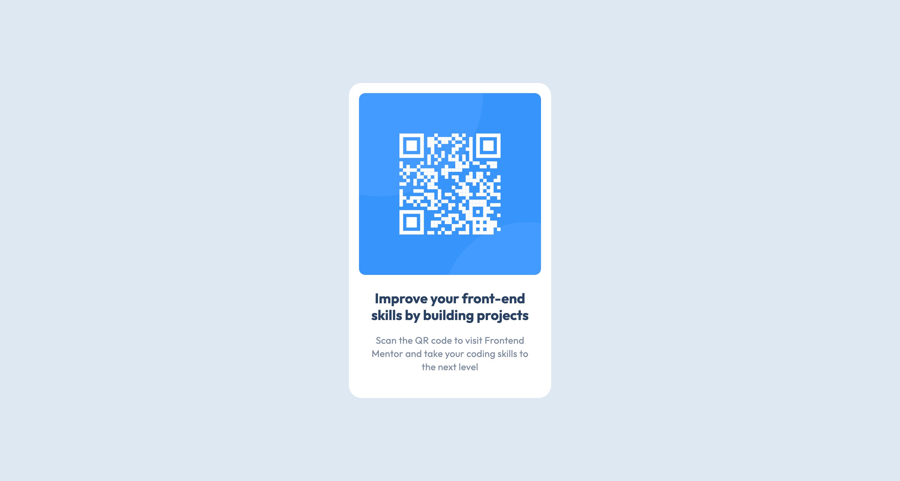

# Frontend Mentor - QR code component solution

This is a solution to
the [QR code component challenge on Frontend Mentor](https://www.frontendmentor.io/challenges/qr-code-component-iux_sIO_H).
Frontend Mentor challenges help you improve your coding skills by building realistic projects.

## Table of contents

- [Overview](#overview)
    - [Screenshot](#screenshot)
    - [Links](#links)
- [My process](#my-process)
    - [Built with](#built-with)
    - [What I learned](#what-i-learned)
    - [Continued development](#continued-development)
    - [Useful resources](#useful-resources)
- [Author](#author)
- [Acknowledgments](#acknowledgments)

## Overview

### Screenshot

### Links

- Solution URL: [GitHub](https://github.com/super7ramp/frontend-mentor/1-qr-code)
- Live Site URL: [TODO]()

## My process

### Built with

- Semantic HTML5 markup
- Flexbox

### What I learned

- Use [`hsl()`](https://developer.mozilla.org/en-US/docs/Web/CSS/color_value/hsl)
- Sizing, notably [`box-sizing: border-box;`](https://stackoverflow.com/questions/4767010/why-does-css-padding-increase-size-of-element)
- Get fonts from [Google Fonts](https://fonts.google.com/specimen/Outfit)
- Get attention to details of Figma designs

### Continued development

Not sure what to do next.

### Useful resources

See [Google Fonts](https://fonts.google.com/specimen/Outfit) for the font used in this project.

## Author

- Website - [Antoine Belvire](https://belv.re)
- Frontend Mentor - [@super7ramp](https://www.frontendmentor.io/profile/super7ramp)

## Acknowledgments

None.
