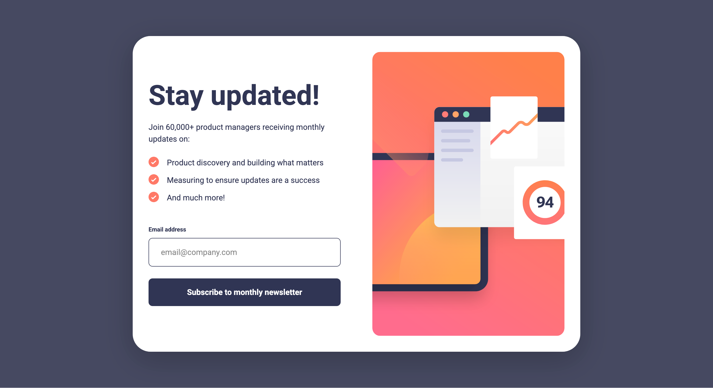

# Frontend Mentor - Newsletter sign-up form with success message solution

This is a solution to
the [Newsletter sign-up form with success message challenge on Frontend Mentor](https://www.frontendmentor.io/challenges/newsletter-signup-form-with-success-message-3FC1AZbNrv).
Frontend Mentor challenges help you improve your coding skills by building realistic projects.

## Table of contents

- [Overview](#overview)
    - [The challenge](#the-challenge)
    - [Screenshot](#screenshot)
    - [Links](#links)
- [My process](#my-process)
    - [Built with](#built-with)
    - [What I learned](#what-i-learned)
    - [Continued development](#continued-development)
    - [Useful resources](#useful-resources)
- [Author](#author)
- [Acknowledgments](#acknowledgments)

## Overview

### The challenge

Users should be able to:

- Add their email and submit the form
- See a success message with their email after successfully submitting the form
- See form validation messages if:
    - The field is left empty
    - The email address is not formatted correctly
- View the optimal layout for the interface depending on their device's screen size
- See hover and focus states for all interactive elements on the page

### Screenshot



### Links

- Solution URL: [GitHub](https://github.com/super7ramp/frontend-mentor/10-newsletter-signup-with-success-message)
- Live Site
  URL: [GitHub Pages](https://super7ramp.github.io/frontend-mentor/10-newsletter-signup-with-success-message/newsletter-sign-up-with-success-message-main/)

## My process

### Built with

- Semantic HTML5 markup
- CSS custom properties
- Flexbox
- CSS Grid
- Mobile-first workflow
- Vanilla JavaScript

### What I learned

#### Client-side validation

##### HTML

HTML provides a way to validate HTML address: It suffices to add the `type="email"` attribute to the `<input>` element.
Don't forget to add the `required` attribute to ensure that the field is not left empty.

```html
<form class="signup-form">
    <!-- ... skipped text and label -->
    <input id="signup-form-email__input"
           class="signup-form__input text-preset-2"
           type="email"
           required
           placeholder="email@company.com"/>
</form>
```

##### CSS

Use the `:user-invalid` pseudo-class to style the input when it is invalid. It is better than `:invalid` because it only
applies when the user has interacted with the input.

```css
.signup-form__input:user-invalid {
    border-color: var(--red);
    background-color: var(--red-100);
}
```

##### JavaScript

Prevent default form submission is important, otherwise the page would reload! Besides that, JavaScript is used to
display an error message next to the label when the email is invalid.

```javascript
const formInputEmail = document.querySelector("#signup-form-email__input")
const formErrorEmail = document.querySelector("#signup-form-email__error")
const form = document.querySelector(".signup-form")

form.addEventListener("submit", e => {
    e.preventDefault()
    if (!formInputEmail.validity.valid) {
        formErrorEmail.innerHTML = "Valid email required"
        return
    }
    /* ... skipped the copy of the email to the success dialog and the opening of the dialog */
})
```

I added a listener for the `input` event to clear the error message when the user starts typing a valid email address:

```javascript
form.addEventListener("input", e => {
    if (!formInputEmail.validity.valid) {
        formErrorEmail.innerHTML = "Valid email required"
        return;
    }
    formErrorEmail.innerHTML = ""
})
```

#### Using the `dialog` element

##### HTML

```html
<dialog class="success-dialog">
    <h1 class="text-preset-1">Thanks for subscribing!</h1>
    <p class="text-preset-2">
        A confirmation email has been sent to <span class="success-dialog__email"></span>.
        Please open it and click the button inside to confirm your subscription.
    </p>
    <button class="success-dialog__close-button text-preset-2--bold button" autofocus>
        Dismiss message
    </button>
</dialog>
```

##### CSS

```css
.success-dialog[open] {
    display: flex;
    flex-direction: column;
    min-height: 100vh;
    max-width: var(--400px);
    padding: 16% var(--spacing-300) var(--spacing-300) var(--spacing-300);
    gap: var(--spacing-400);
    margin: auto; /* this is how dialog is centered implicitly before CSS reset, let's re-add it. */
    border: none;

    background-color: white;
    color: var(--blue-800);
}
```

CSS was a bit tricky for two reasons:

- The `dialog` element has a default `display: none;` and switches to `display: block;` when opened via JavaScript.
  However, we want to use `display: flex;` to allow for a flexible layout inside the dialog. To do that, we need to
  add the attribute selector `[open]` to the CSS rule.
- The `dialog` element is centered by default, but the CSS reset removes that. So we need to re-add the centering.

##### JavaScript

```javascript
const form = document.querySelector(".signup-form")
const successDialog = document.querySelector(".success-dialog")

form.addEventListener("submit", e => {
    /* ... form validation and copy email to dialog skipped */
    successDialog.showModal()
})

const dismissButton = document.querySelector(".success-dialog__close-button")
dismissButton.addEventListener("click", () => successDialog.close())
```

### Continued development

Use third-party library or framework for form validation.

### Useful resources

- [Form validation on MDN](https://developer.mozilla.org/en-US/docs/Learn_web_development/Extensions/Forms/Form_validation) -
  For the email validation.
- [`linear-gradient()` on MDN](https://developer.mozilla.org/fr/docs/Web/CSS/gradient/linear-gradient) - For the button
  gradient.
- [`dialog` on MDN](https://developer.mozilla.org/en-US/docs/Web/HTML/Reference/Elements/dialog)

## Author

- Website - [Antoine Belvire](https://belv.re)
- Frontend Mentor - [@super7ramp](https://www.frontendmentor.io/profile/super7ramp)

## Acknowledgments

All reviewers for their feedback ❤️
