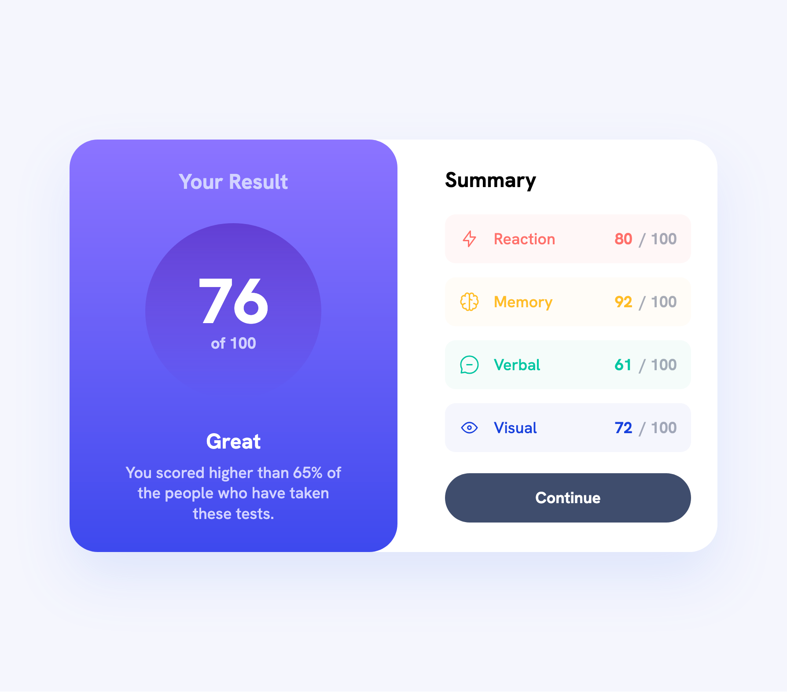

# Frontend Mentor - Results summary component solution

This is a solution to
the [Results summary component challenge on Frontend Mentor](https://www.frontendmentor.io/challenges/results-summary-component-CE_K6s0maV).
Frontend Mentor challenges help you improve your coding skills by building realistic projects.

## Table of contents

- [Overview](#overview)
    - [The challenge](#the-challenge)
    - [Screenshot](#screenshot)
    - [Links](#links)
- [My process](#my-process)
    - [Built with](#built-with)
    - [What I learned](#what-i-learned)
    - [Continued development](#continued-development)
    - [Useful resources](#useful-resources)
- [Author](#author)
- [Acknowledgments](#acknowledgments)

## Overview

### The challenge

Users should be able to:

- View the optimal layout for the interface depending on their device's screen size
- See hover and focus states for all interactive elements on the page
- **Bonus**: Use the local JSON data to dynamically populate the content

### Screenshot



### Links

- Solution URL: [GitHub](https://github.com/super7ramp/frontend-mentor/12-results-summary-component)
- Live Site URL: [Netlify](https://cheerful-snickerdoodle-633290.netlify.app/)

## My process

### Built with

- Semantic HTML5 markup
- CSS custom properties
- Flexbox
- CSS Grid
- Mobile-first workflow
- [React](https://reactjs.org/) - JS library

### What I learned

#### Create React components

```
src/components/
├── Button.css
├── Button.jsx
├── FinalScoreCard.css
├── FinalScoreCard.jsx
├── ResultSummary.css
├── ResultSummary.jsx
├── ScoreEntry.css
├── ScoreEntry.jsx
├── ScoreList.css
└── ScoreList.jsx

1 directory, 10 files
```

### Continued development

- Get used to React
- Learn how to properly reference assets
- Check out PostCSS for styling

### Useful resources

- [Vite's Getting Started](https://vite.dev/guide/) - Perfect for setting up a React project quickly.

## Author

- Website - [Antoine Belvire](https://belv.re)
- Frontend Mentor - [@super7ramp](https://www.frontendmentor.io/profile/super7ramp)

## Acknowledgments

All reviewers for their feedback ❤️
