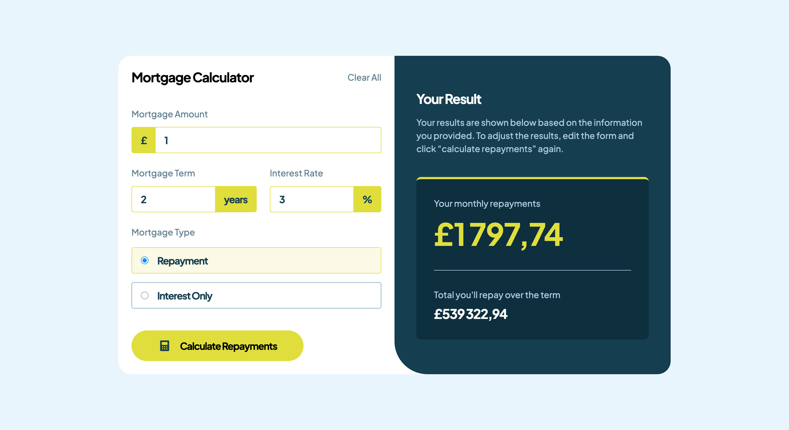

# Frontend Mentor - Mortgage repayment calculator solution

This is a solution to
the [Mortgage repayment calculator challenge on Frontend Mentor](https://www.frontendmentor.io/challenges/mortgage-repayment-calculator-Galx1LXK73).
Frontend Mentor challenges help you improve your coding skills by building realistic projects.

## Table of contents

- [Overview](#overview)
    - [The challenge](#the-challenge)
    - [Screenshot](#screenshot)
    - [Links](#links)
- [My process](#my-process)
    - [Built with](#built-with)
    - [What I learned](#what-i-learned)
    - [Continued development](#continued-development)
    - [Useful resources](#useful-resources)
- [Author](#author)
- [Acknowledgments](#acknowledgments)

## Overview

### The challenge

Users should be able to:

- Input mortgage information and see monthly repayment and total repayment amounts after submitting the form
- See form validation messages if any field is incomplete
- Complete the form only using their keyboard
- View the optimal layout for the interface depending on their device's screen size
- See hover and focus states for all interactive elements on the page

### Screenshot

### Links

- Solution URL: [Add solution URL here](https://your-solution-url.com)
- Live Site URL: [Add live site URL here](https://your-live-site-url.com)

## My process

### Built with

- Semantic HTML5 markup
- CSS custom properties
- Flexbox
- CSS Grid
- Mobile-first workflow
- [React](https://reactjs.org/) - JS library

### What I learned

#### Validation and React

React doesn't offer built-in form validation.

To get data from the form, all the components must be controlled, so that upper component can access the data and
submit it.

I relied on the HTML validation given that there was no need for complex validation/error messages. But I really
need to explore validation libraries for larger projects.

### Continued development

- Explore Formik and React Hook Form for form handling and validation in React applications. Vanilla experience was not
  that great.

### Useful resources

- [Client-side form validation](https://developer.mozilla.org/en-US/docs/Learn_web_development/Extensions/Forms/Form_validation) -
  Explains the built-in HTML validation plus the JavaScript Constraint Validation API.

## Author

- Website - [Antoine Belvire](https://belv.re)
- Frontend Mentor - [@super7ramp](https://www.frontendmentor.io/profile/super7ramp)

## Acknowledgments

All reviewers for their feedback ❤️

