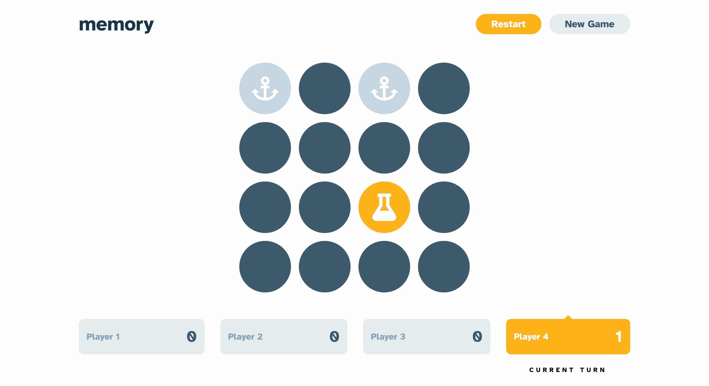

# Frontend Mentor - Memory game solution

This is a solution to
the [Memory game challenge on Frontend Mentor](https://www.frontendmentor.io/challenges/memory-game-vse4WFPvM). Frontend
Mentor challenges help you improve your coding skills by building realistic projects.

## Table of contents

- [Overview](#overview)
    - [The challenge](#the-challenge)
    - [Screenshot](#screenshot)
    - [Links](#links)
- [My process](#my-process)
    - [Built with](#built-with)
    - [What I learned](#what-i-learned)
    - [Continued development](#continued-development)
    - [Useful resources](#useful-resources)
- [Author](#author)
- [Acknowledgments](#acknowledgments)

## Overview

### The challenge

Users should be able to:

- View the optimal layout for the game depending on their device's screen size
- See hover states for all interactive elements on the page
- Play the Memory game either solo or multiplayer (up to 4 players)
- Set the theme to use numbers or icons within the tiles
- Choose to play on either a 6x6 or 4x4 grid

### Screenshot



### Links

- Solution URL: [GitHub](https://github.com/super7ramp/frontend-mentor/tree/main/16-memory-game/memory-game-react)
- Live Site URL: [Netlify](https://cute-cranachan-d4df80.netlify.app/)

## My process

### Built with

- Semantic HTML5 markup
- CSS custom properties
- Flexbox
- CSS Grid
- Mobile-first workflow
- [React](https://reactjs.org/) - JS library

### What I learned

#### Implement a state machine for the game logic

Used a state machine to implement the game logic. Implemented in a classic OOP style :

```ts
abstract class Game {

    // ...

    /**
     * Called after a timeout.
     *
     * @returns the next game state, or this instance if there is no state change
     */
    abstract onTimeout(): Game;

    /**
     * Called when the user clicks on a cell.
     *
     * @param cell the cell that was clicked
     * @returns the next game state, or this instance if there is no state change
     */
    abstract onUserClick(cell: Cell): Game;

}

class GameReady extends Game {
    // ...
}

class GameUserPickedFirst extends Game {
    // ...
}

class GameUserPickedSecond extends Game {
    // ...
}

class GameFinished extends Game {
    // ...
}
```

Tested the logic with unit tests, using the [Vitest](https://vitest.dev/) testing framework:

```ts
describe('GameReady', () => {

    it('initializes', () => {
        const game = gameReady()

        expect(game.whoseTurn()).toEqual(1)
        expect(game.isFinished()).toBe(false)
        expect(game.cells.every(cell => cell.every(cell => cell.state == "hidden"))).toBe(true)
    })

    it('allows a player to click a cell', () => {
        const game = gameReady()

        const updatedGame = game.onUserClick(game.cells[0][0])

        expect(updatedGame).not.toBe(game)
        expect(updatedGame.cells[0][0].state).toBe("shown")
        expect(mockedActions.recordPlayerMove).toHaveBeenCalledWith(1)
    })
})
```

#### Parameterized tests with Vitest

```ts
test.for([
    {playerCount: 1, turns: 2, expectedWhose: 1},
    {playerCount: 2, turns: 3, expectedWhose: 2},
    {playerCount: 3, turns: 4, expectedWhose: 2},
    {playerCount: 4, turns: 42, expectedWhose: 3}
])('$playerCount P - After $turns turns', ({playerCount, turns, expectedWhose}) => {

    const gameAfterTurns = play(Turn.initial(playerCount as 1 | 2 | 3 | 4), turns)
    const whose = gameAfterTurns.whose()
    expect(whose).toBe(expectedWhose)

})
```

#### Capsule-shaped button for free

Amazing how simply applying a very large border-radius can create a capsule-shaped button:

```scss
@mixin button--rounded {
    /* Capsule-shaped button by applying a very large border-radius (https://stackoverflow.com/a/18795153) */
    border-radius: 42rem;
}
```

Reason would come from the CSS specs:

> Corner curves must not overlap: When the sum of any two adjacent border radii exceeds the size of the border box, UAs
> must proportionally reduce the used values of all border radii until none of them overlap

#### Google Translate can break counter updates

Google Translate can break counter updates or even crash a React app. It did break the move counter updates in this app.

The issue is well explained
in [this blog post](https://martijnhols.nl/blog/everything-about-google-translate-crashing-react).

As a workaround, I wrapped the counter in a `span` element:

```
diff --git a/16-memory-game/memory-game-react/src/components/Stat.tsx b/16-memory-game/memory-game-react/src/components/Stat.tsx
index 2e57e0e..17f1f48 100644
--- a/16-memory-game/memory-game-react/src/components/Stat.tsx
+++ b/16-memory-game/memory-game-react/src/components/Stat.tsx
@@ -25,7 +25,10 @@ function StatCount({label, count, unit, direction = "row", variant = "default",
                 <p className={styleOf("stat__key", variant, big)}>{label}</p>
             }
             valueElement={
-                <p className={styleOf("stat__value", variant, big)}>{count}{unit && ` ${unit}`}</p>
+                <p className={styleOf("stat__value", variant, big)}>
+                    <span>{count}</span>
+                    <span>{unit && ` ${unit}`}</span>
+                </p>
             }
             direction={direction}
             variant={variant}
```

### Continued development

- Check other ways to create state machines in TypeScript :
    - Something different than OOP, like a functional approach (?)
    - Using a library like [XState](https://xstate.js.org/)
- Improve tests.
- Improve CSS consistency/readability.

### Useful resources

- [The TypeScript Handbook](https://www.typescriptlang.org/docs/handbook/intro.html)
- [Vitest documentation](https://vitest.dev/guide/)

## Author

- Website - [Antoine Belvire](https://belv.re)
- Frontend Mentor - [@super7ramp](https://www.frontendmentor.io/profile/super7ramp)

## Acknowledgments

All reviewers for their feedback ❤️
