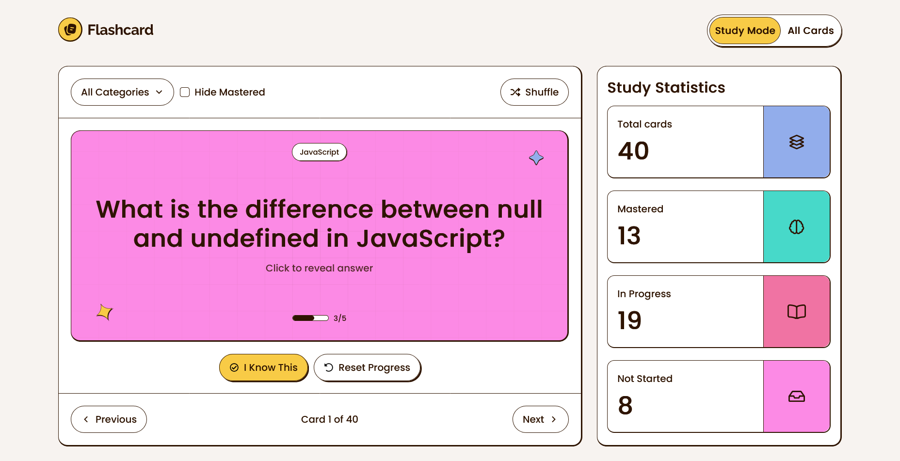

# Frontend Mentor - Flashcard app solution

This is a solution to the [Flashcard app challenge on Frontend Mentor](https://www.frontendmentor.io/challenges/flashcard-app). Frontend Mentor challenges help you improve your coding skills by building realistic projects. 

## Table of contents

- [Overview](#overview)
  - [The challenge](#the-challenge)
  - [Screenshot](#screenshot)
  - [Links](#links)
- [My process](#my-process)
  - [Built with](#built-with)
  - [What I learned](#what-i-learned)
  - [Continued development](#continued-development)
  - [Useful resources](#useful-resources)
- [Author](#author)
- [Acknowledgments](#acknowledgments)

## Overview

### The challenge

Users should be able to:

#### Flashcard Management

- [x] Create new flashcards with a question, answer, and category
- [x] Edit existing flashcards to update their details
- [x] Delete flashcards they no longer need
- [x] See form validation messages when trying to submit a card without all fields completed
- [x] View all their flashcards in a grid layout
- [x] See flashcard details including question, answer, category, and mastery progress

#### Study Mode

- [x] Study flashcards one at a time in Study Mode
- [x] Click on a flashcard to reveal the answer
- [x] Mark a flashcard as known by clicking "I Know This" to track mastery progress
- [x] Navigate between flashcards using Previous and Next buttons
- [x] See which card they're currently viewing (e.g., "Card 1 of 40")
- [x] Track mastery progress for each card on a scale of 0 to 5
- [x] Reset progress on a flashcard to start learning it again

#### Filtering & Organization

- [x] Filter flashcards by selecting one or multiple categories
- [x] See the number of cards in each category within the filter dropdown
- [x] Hide mastered cards to focus on cards that still need practice
- [x] Shuffle flashcards to randomize the study order

#### Statistics & Progress

- [x] View study statistics showing total cards, mastered, in progress, and not started counts

#### UI & Navigation

- [x] Toggle between Study Mode and All Cards views
- [x] Load more flashcards when viewing the full card list with more than 12 cards
- [ ] See a toast message when a card is created, updated, or deleted
- [x] View the optimal layout for the interface depending on their device's screen size
- [x] See hover and focus states for all interactive elements on the page
- [x] Navigate the entire app using only their keyboard

### Screenshot



### Links

- Solution URL: [GitHub](https://github.com/super7ramp/frontend-mentor/tree/main/17-flashcard-app/flashcard-uix)
- Live Site URL: [Netlify](https://fastidious-fox-6df87e.netlify.app/)

## My process

### Built with

- Mobile-first workflow
- [ClojureScript](https://clojurescript.org/)
- [UIx](https://uix-cljs.dev/) (ClojureScript wrapper over [React](https://reactjs.org/))

### What I learned

#### ClojureScript

[Clojure](https://clojure.org) is a language from the Lisp family that runs on the JVM. It is dynamic, functional-oriented and stable. [ClojureScript](https://clojurescript.org/) is a Clojure that transpiles to JavaScript.

Both are nice!

I have been playing with Clojure for a few months, this challenge is my first experience with ClojureScript.

##### Calling js code

```cljs
(defn- fetch-data []
  (-> (js/fetch "data/data.json")
      (.then #(.json %))
      (.then #(js->clj % :keywordize-keys true))
      (.then #(:flashcards %))
      (.catch #(js/console.log %))))
```

js core functions can be used directly, just prefix them with `js/`.

Then use the [dot notation](https://cljs.github.io/api/syntax/dot) to access js object functions/fields.

Note also the `cljs.core` [`js->clj`](https://cljs.github.io/api/cljs.core/js-GTclj) and [`clj->js`](https://cljs.github.io/api/cljs.core/clj-GTjs) functions that allow to convert ClojureScript data structures from/to JavaScript data structures.

##### Importing js code

Requiring it like a namespace, but between quotes:

```cljs
(ns app.core
  (:require [app.pages.edit :refer [edit]]
            [app.pages.study :refer [study]]
            ["react-router" :refer [BrowserRouter Routes Route]]))

(defui app []
  ($ BrowserRouter
    ($ Routes
      ($ Route {:path "/" :element ($ study)})
      ($ Route {:path "/edit" :element ($ edit)})))))

```

##### Clojure(Script) goodness

Counting how many times each category appears in the flashcard deck:

```cljs
(->> cards           ; the variables holding the array of cards. A card contains the field ':category'.
     (map :category) ; map cards to a sequence of card categories
     frequencies     ; count the occurrences of each category and put them into a map (key = category, value = count) 
     sort)           ; sort them by key
```

(The `->>` is a [threading macro](https://clojure.org/guides/threading_macros), it passes the result of an expression as the last argument of the next expression.)

It wouldn't be much more complicated to do in js, but still, Clojure(Script) offers the `frequencies` function for free, I find this nice to write and read.

##### Specs (props validation)

There is a library called `clojure.spec` (or `cljs.spec` for cljs) which allows to define the "shape" of data. A bit like PropTypes.

```cljs
(ns app.models.card
  (:require [cljs.spec.alpha :as s]))

(s/def ::id string?)
(s/def ::category string?)
(s/def ::question string?)
(s/def ::answer string?)
(s/def ::knownCount (s/int-in 0 6))
(s/def ::card (s/keys :req-un [::id
                               ::question
                               ::answer
                               ::category
                               ::knownCount]))
```

Note : req = required and un = unqualified, i.e. input key is required but can be e.g. `:id` instead of `:app.models.card/id`.

I've used the spec on the "boundary", when reading/saving cards from/to local storage, as pre/post conditions:

```cljs
(ns app.providers.cards
  (:require [app.hooks.use-local-storage :refer [use-local-storage]]
            [app.models.card :as model]
            [cljs.spec.alpha :as s]
            [uix.core :refer [$ create-context defui use-callback use-effect use-state]]))
; ...

(s/def ::stored-cards (s/nilable (s/coll-of ::model/card)))

(defui cards-provider
  "Provides, via the `*cards*` context, the cards retrieved from local storage or remote API."
  [{:keys [children]}]
  (let [[cards set-cards] (use-state [])
        [get-stored-cards store-cards] (use-local-storage "cards" ::stored-cards)
        ;...
  ]))
```

```cljs
(ns app.hooks.use-local-storage
  (:require [cljs.spec.alpha :as s]
            [uix.core :refer [defhook use-callback]]))

(defhook use-local-storage [key spec]
  "Hook that provides read/write access to local storage."
  {:pre [(some? key) (s/spec? spec)]}
  (let [get-item (use-callback (fn []
                                 {:post [(s/valid? spec %)]}
                                 (-> (.getItem js/localStorage key)
                                     js/JSON.parse
                                     (js->clj :keywordize-keys true)))
                               [key spec])
        set-item (use-callback (fn [item]
                                 {:pre [(s/valid? spec item)]}
                                 (->> (clj->js item)
                                      js/JSON.stringify
                                      (.setItem js/localStorage key)))
                               [key spec])]
    [get-item set-item]))
```

I find the syntax a bit verbose but at least it works: It allowed me to spot an issue where I stored flashcard ids as UUID objects instead of strings, which "worked" in practice but wasn't what I intended.

##### (My?) Limitations

I didn't find a way to import assets in cljs like in js. So I put them in the `public` folder.

Same for CSS imports. The UIx starter project uses lightning-css to bundle all CSS files so that's ok. I wonder how to setup CSS modules still.

#### UIx

[UIx](https://uix-cljs.dev/) is a React wrapper for ClojureScript. It has been a pleasure to use:

- It's really close to React on js/ts, all the hooks seem to be there (`use-state`, `use-effect`, `use-callback`, ...)
- It works well: No bug encountered, just a few issues with the starter project's npm scripts which were not Windows-proof.
- It's well documented: I could find what I wanted to read, when I wanted to read it, it was very satisfying.

To get started, I used the starter (Java/Clojure already installed):

```sh
npx create-uix-app@latest flashcard-uix
```

An example of component (it's the grid of cards below the create form, in the edit page):

```cljs
(ns app.components.edit.deck-explorer
  (:require [app.components.deck-transformer :refer [deck-transformer]]
            [app.components.edit.card-summary :refer [card-summary]]
            [app.hooks.use-deck :refer [use-deck]]
            [uix.core :refer [$ defui use-state]]))

(defui deck-explorer
  "
   A component allowing to explore the deck of cards.

   Cards may be displayed progressively using the `display-chunk-size` parameter.
  "
  [{:keys [display-chunk-size] :or {display-chunk-size 12}}]
  (let [{:keys [cards shuffle category-frequencies filters]} (use-deck)
        [displayed-count set-displayed-count] (use-state display-chunk-size)
        more-to-display (< displayed-count (count cards))]
    ($ :div.deck-explorer
       ($ deck-transformer {:category-frequencies category-frequencies
                            :shuffle shuffle
                            :& filters})
       ($ :ul.deck-explorer__card-summaries
          (->> cards
               (take displayed-count)
               (map #($ :li {:key (:id %)} ($ card-summary %)))))
       (when more-to-display
         ($ :button.with-shadow.deck-explorer__load-more
            {:on-click #(set-displayed-count (+ displayed-count display-chunk-size))}
            "Load more")))))
```

- `defui` to define a (UIx) component, very similar to `defn` for creating functions
- `$` to create a React component
- Props are passed as ClojureScript maps
- A peculiar syntax for element/classes but I find it intuitive enough. Also classes can be passed as `class-name` prop, it will be merged with classes declared on element.

#### CSS

##### Compose backgrounds

For the card:

```css
.card {
     background:
        url("/assets/images/pattern-flashcard-bg.svg"),
        left 5% top 90% url("/assets/images/pattern-star-yellow.svg") no-repeat,
        right 5% bottom 90% url("/assets/images/pattern-star-blue.svg") no-repeat,
        var(--pink-400);
}
```

##### Limitations of `data-*` attributes

When implementing progress bar, I thought I could control the progress bar with a data attribute, something like:


```css
.progress-bar__bar-inside[data-progress] {
   height: 0.5rem;
   width: attr(data-progress);
   background-color: var(--neutral-900);
   border-radius: var(--radius-full);
}
```

```cljs
(defui progress-bar
  "A learning progress bar, displaying progress between 0 and 5."
  [{:keys [known-count]}]
  (let [progress-percent (* 100 (/ known-count 5))]
    ; ...
    ($ :div.progress-bar__bar-inside {:data-progress (str progress-percent "%")}))
    ; ...
    )
```

But it didn't work. As far as I understand, the `attr()` CSS function has some limitations. Ended up doing a CSS variable instead:

```css
.progress-bar__bar-inside {
   --progress: 0%;
   height: 0.5rem;
   width: var(--progress);
   background-color: var(--neutral-900);
   border-radius: var(--radius-full);
}
```

```cljs
(defui progress-bar
  "A learning progress bar, displaying progress between 0 and 5."
  [{:keys [known-count]}]
  (let [progress-percent (* 100 (/ known-count 5))]
    ; ...
    ($ :div.progress-bar__bar-inside {:style {:--progress (str progress-percent "%")}}))
    ; ...
    )
```

##### Implementing my own select

Because native select is hard to style. Used the popover API for the dropdown.

##### Anchor Positioning

For the dropdown of the category selection and the edit menu:

```css
.dropdown {
    position: absolute;
    inset: auto;
    /*
      On Firefox without anchor positioning support, 'margin-top' miraculously suffices to place
      the dropdown relatively to the previous element (despite popover supposed to be on top layer 🤷).
      So positioning "works" on Firefox as long as the "anchor" is the previous element.
    */
    margin-top: var(--spacing-100);
    border: var(--border-solid);
    border-radius: var(--radius-8);
    background-color: var(--neutral-0);
    box-shadow: 0 3px 8px rgb(from var(--neutral-900) r g b / 20%);
}

@supports (position-area: bottom) {
    .dropdown {
        position-area: bottom span-right;
        position-try-fallbacks: flip-inline;
    }
}
```

Anchor is defined in cljs:

```cljs
(ns app.components.dropdown
  (:require [uix.core :refer [$ defui]]))

; ...

(defui dropdown
  "A dropdown. Children should be dropdown entries or at least have a key."
  [{:keys [id class-name children]}]
  (let [anchor-name (str "dropdown-anchor-" id)]
    ($ :div {:style {:anchor-name anchor-name}}
       ($ :ul.dropdown {:id id
                        :class-name class-name
                        :popover ""
                        :style {:position-anchor anchor-name}}
          children))))
```

##### Customizing checkboxes

Checkboxes are not the easiest things to style but with `appareance: none` and a background image for the tick, it's ok:

```css
input[type=checkbox] {
    appearance: none;
    height: 1rem;
    width: 1rem;
    border: var(--border-solid);
    border-radius: var(--radius-4);
}

input[type=checkbox]:checked {
    background-color: var(--yellow-500);
    background-image: url("data:image/svg+xml,%3Csvg width='9' height='7' viewBox='0 0 9 7' fill='none' xmlns='http://www.w3.org/2000/svg'%3E%3Cpath d='M7.98828 0.0976562C8.08594 0 8.24219 0 8.32031 0.0976562L8.88672 0.644531C8.96484 0.742188 8.96484 0.898438 8.88672 0.976562L3.02734 6.83594C2.92969 6.93359 2.79297 6.93359 2.69531 6.83594L0.078125 4.23828C0 4.14062 0 3.98438 0.078125 3.90625L0.644531 3.33984C0.722656 3.26172 0.878906 3.26172 0.976562 3.33984L2.85156 5.23438L7.98828 0.0976562Z' fill='%232E1401'/%3E%3C/svg%3E%0A");
    background-position: center;
    background-repeat: no-repeat;
    background-size: 62.5%;
}

input[type=checkbox]:not(:focus):hover {
    box-shadow: 1px 1px 0 var(--neutral-900);
}
```

##### Transitions

Used the `transition` property to animate on CSS property changes, e.g. for card background:

```css
.card {
    /* ... */
    transition: background var(--fade-duration-slow);
}
```

Couldn't find a way to do the text card animation with it though: Tried to animate on the `order` property but it didn't work, didn't spend more time on it.

##### CSS without SCSS is not as nice

I went full CSS because the UIx template didn't setup SCSS and I didn't want to spend more time on tool setup. I took that like an opportunity to try again a "vanilla CSS" approach and see what can be done with modern CSS.

###### Nesting

CSS has now `&` but it is not as nice as in SCSS when using BEM, e.g. one can't write in CSS:

```scss
my-block {
    &__my-element {
        /* something */
    }
}
```

One has to write:

```scss
my-block {
    my-block__my-element {
        /* something */
    }
}
```

###### Mixins

Not available yet in any browser. It's a shame, I really like composing SCSS mixins in CSS classes, instead of composing utility classes inside the HTML.

#### Deployment on Netlify

Netlify supports ClojureScript: Its build image includes Java and Clojure. But both Java and Clojure versions are seriously outdated: Java 8 and Clojure 1.10.1.

So, it doesn't work out-of-the box with the latest shadow-cljs:

- It has weird issues with this old Clojure, probably related to `tools.deps` (failure to resolve dependencies correctly, the hint was `WARNING: Specified aliases are undeclared: [:-A]`). A workaround is to perform a `clj -A:dev` before running shadow-cljs so that clj self-updates to the version specified in the project. 
- ClojureScript requires Java 21: `java.lang.UnsupportedClassVersionError: com/google/javascript/jscomp/CompilerOptions has been compiled by a more recent version of the Java Runtime (class file version 65.0), this version of the Java Runtime only recognizes class file versions up to 52.0` (that's actually a class from Google Closure Compiler used by ClojureScript).

Thanksfully, Netlify [allows to install additional dependencies with brew](https://answers.netlify.com/t/java-11-support/67078/17).

Thus the Netlify build command for this project is `brew install openjdk && clj -A:dev --help && npm run release`.

### Continued development

Things I'd like to continue working on, on this challenge or a next one with ClojureScript/UIx:

- Tests.

### Useful resources

- [UIx documentation](https://github.com/pitch-io/uix?tab=readme-ov-file#docs).
- [Kevin Powell's video on anchor positioning](https://www.youtube.com/watch?v=DNXEORSk4GU) - Nice introduction to anchor positioning, also addresses compatibility (polyfills)
- [Anchoreum](https://anchoreum.com/) - A playful introduction to anchor positioning, in the style of Flexbox Froggy and Grid Garden
- [Animating dialog and popover elements with CSS `@starting-style`](https://blog.logrocket.com/animating-dialog-popover-elements-css-starting-style/) - Title says it all.
- [MDN](https://developer.mozilla.org/fr/) - Always, consulted approximately a billion times.

## Author

- Website - [Antoine Belvire](https://belv.re)
- Frontend Mentor - [@super7ramp](https://www.frontendmentor.io/profile/super7ramp)

## Acknowledgments

All reviewers for their feedback ❤️
