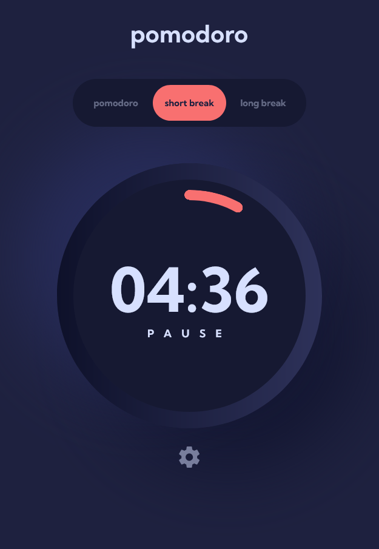

# Frontend Mentor - Pomodoro app solution

This is a solution to the [Pomodoro app challenge on Frontend Mentor](https://www.frontendmentor.io/challenges/pomodoro-app-KBFnycJ6G). Frontend Mentor challenges help you improve your coding skills by building realistic projects.

## Table of contents

- [Overview](#overview)
  - [The challenge](#the-challenge)
  - [Screenshot](#screenshot)
  - [Links](#links)
- [My process](#my-process)
  - [Built with](#built-with)
  - [What I learned](#what-i-learned)
  - [Continued development](#continued-development)
  - [Useful resources](#useful-resources)
- [Author](#author)
- [Acknowledgments](#acknowledgments)

## Overview

### The challenge

Users should be able to:

- [x] Set a pomodoro timer and short & long break timers
- [x] Customize how long each timer runs for
- [x] See a circular progress bar that updates every minute and represents how far through their timer they are
- [x] Customize the appearance of the app with the ability to set preferences for colors and fonts

### Screenshot



### Links

- Solution URL: [Add solution URL here](https://your-solution-url.com)
- Live Site URL: [Add live site URL here](https://your-live-site-url.com)

## My process

### Built with

- Semantic HTML5 markup
- CSS custom properties
- SASS
- Mobile-first workflow
- [React](https://reactjs.org/) - JS library

### What I learned

#### Drawing a circular progressbar in pure CSS

```scss
// The custom property defintion is required for the animation
@property --progress {
  syntax: "<number>";
  inherits: false;
  initial-value: 0;
}

.timer {
  // ...

  &__arc {
    --_thickness: 0.85rem;
    --_progress: calc(360deg * var(--progress));
    --_edge: /var(--_thickness) var(--_thickness) no-repeat
      radial-gradient(50% 50%, #000 97%, #0000);
    padding: var(--_thickness);
    margin: var(--_thickness);
    border-radius: 50%;
    background: var(--accent-color);
    mask:
      // start rounded edge
      top var(--_edge),
      // end rounded edge
      calc(50% + 50% * sin(var(--_progress)))
        calc(50% - 50% * cos(var(--_progress))) var(--_edge),
      // a transparent gradient that mask the inner part of the progress gradient
      linear-gradient(#0000 0 0) content-box intersect,
      // the progress gradient
      conic-gradient(#000 var(--_progress), #0000 0);
    transition: --progress 0.5s;
  }
}
```

### Continued development

Things I'd like to improve:

- Accessibility: There are things to do add to make the timers accessible.
- Animation: On tab switching, on timer end.

### Useful resources

- [Create an animated, circular progress bar](https://www.youtube.com/watch?v=MXWP56LUI3g) - A Kevin Powel video on how to create a circular progressbar. Very instructive, the only info I missed was how to implement rounded edges (progressbar edges are not rounded in the video, he quickly mentions it's possible to do it with svg though).
- [css-shape.com](https://css-shape.com/arc/) - For the circular progressbar rounded edges

## Author

- Website - [Antoine Belvire](https://belv.re)
- Frontend Mentor - [@super7ramp](https://www.frontendmentor.io/profile/super7ramp)

## Acknowledgments

All reviewers for their feedback ❤️
