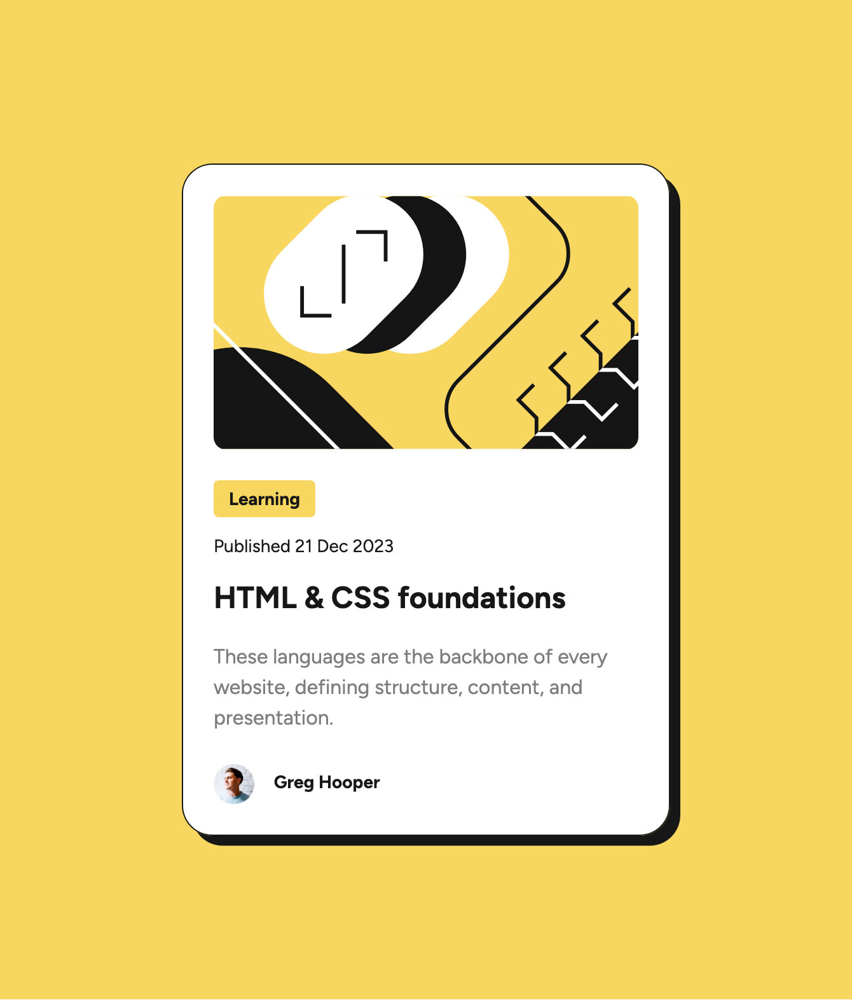

# Frontend Mentor - Blog preview card solution

This is a solution to
the [Blog preview card challenge on Frontend Mentor](https://www.frontendmentor.io/challenges/blog-preview-card-ckPaj01IcS).
Frontend Mentor challenges help you improve your coding skills by building realistic projects.

## Table of contents

- [Overview](#overview)
    - [The challenge](#the-challenge)
    - [Screenshot](#screenshot)
    - [Links](#links)
- [My process](#my-process)
    - [Built with](#built-with)
    - [What I learned](#what-i-learned)
    - [Continued development](#continued-development)
    - [Useful resources](#useful-resources)
- [Author](#author)
- [Acknowledgments](#acknowledgments)

## Overview

### The challenge

Users should be able to:

- See hover and focus states for all interactive elements on the page

### Screenshot



### Links

- Solution URL: [GitHub](https://github.com/super7ramp/frontend-mentor/2-blog-preview-card)
- Live Site
  URL: [GitHub Pages](https://super7ramp.github.io/frontend-mentor/2-blog-preview-card/blog-preview-card-main/)

## My process

### Built with

- Semantic HTML5 markup
- Flexbox

### What I learned

### Images are `inline` elements

But they look like `inline-block` as well. Anyway they can be changed to `display: block`, which I found practical to
do the cropping.

#### Add a gap between elements of a div without flexbox

```css
.blog-preview > * + * {
    margin-top: 24px;
}
```

#### Use a custom font with `@font-face`

```css
@font-face {
    font-family: "Figtree";
    src: url("assets/fonts/Figtree-VariableFont_wght.ttf")
}
```

#### Variables

```css
* {
    --yellow: hsl(47, 88%, 63%);
    --gray-950: hsl(0, 0%, 7%);
    --gray-500: hsl(0, 0%, 42%);
}
```

#### Font scaling without media queries

Using `calc()` and `clamp()` to scale the font size based on the viewport width:

```css
* {
    --preview-max-width-px: 384;
    --preview-max-width: 384px;
    --preview-min-width-px: 327;
    --preview-min-width: 327px;
    --preview-max-over-min: calc(var(--preview-max-width-px) / var(--preview-min-width-px));
}

h1 {
    /* font size is between 20px and 24px */
    --scale-adjustment: calc(var(--preview-max-over-min) / (24 / 20));
    font-size: calc(clamp(var(--preview-min-width) * var(--scale-adjustment), 100vw, var(--preview-max-width)) * 24 / var(--preview-max-width-px));
}
```

Expanding `clamp()`:

```css
h1 {
    /* font size is between 20px and 24px */
    --scale-adjustment: calc(var(--preview-max-over-min) / (24 / 20));
    font-size: calc(max(var(--preview-min-width) * var(--scale-adjustment), min(100vw, var(--preview-max-width))) * 24 / var(--preview-max-width-px));
}
```

It is not simple enough though; It would be nice to be able to define once a function that does this and use it like
this:

```css
h1 {
    font-size: --my-scale(/* min */ 20px, /* max */ 24px);
}
```

### Continued development

Not sure what to do next.

### Useful resources

- [This StackOverflow post](https://stackoverflow.com/a/62305157) - For the gap without flexbox.
- [MDN](https://developer.mozilla.org/en-US/) - Always useful.

## Author

- Website - [Antoine Belvire](https://belv.re)
- Frontend Mentor - [@super7ramp](https://www.frontendmentor.io/profile/super7ramp)

## Acknowledgments

None yet.
