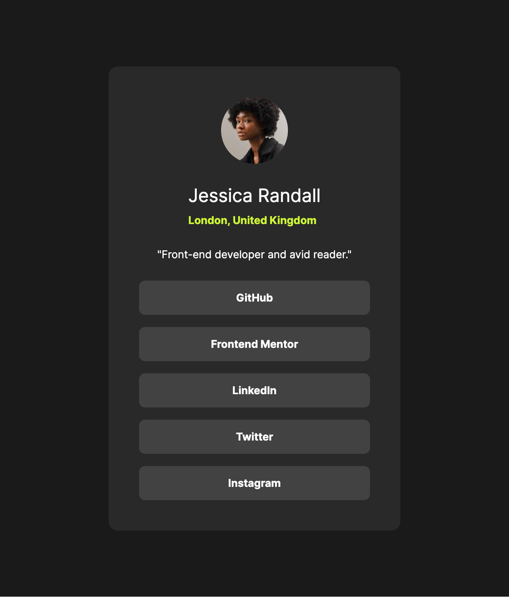

# Frontend Mentor - Social links profile solution

This is a solution to
the [Social links profile challenge on Frontend Mentor](https://www.frontendmentor.io/challenges/social-links-profile-UG32l9m6dQ).
Frontend Mentor challenges help you improve your coding skills by building realistic projects.

## Table of contents

- [Overview](#overview)
    - [The challenge](#the-challenge)
    - [Screenshot](#screenshot)
    - [Links](#links)
- [My process](#my-process)
    - [Built with](#built-with)
    - [What I learned](#what-i-learned)
        - [CSS `transition`](#css-transition)
        - [Media queries to reduce the padding on mobile version](#media-queries-to-reduce-the-padding-on-mobile-version)
        - [Variable fonts](#variable-fonts)
    - [Continued development](#continued-development)
    - [Useful resources](#useful-resources)
- [Author](#author)
- [Acknowledgments](#acknowledgments)

## Overview

### The challenge

Users should be able to:

- See hover and focus states for all interactive elements on the page

### Screenshot



### Links

- Solution URL: [GitHub](https://github.com/super7ramp/frontend-mentor/3-social-links-profile)
- Live Site
  URL: [GitHub Pages](https://super7ramp.github.io/frontend-mentor/3-social-links-profile/social-links-profile-main/)

## My process

### Built with

- Semantic HTML5 markup
- Flexbox

### What I learned

#### CSS `transition`

It's so simple to use:

```css
.links li {
    transition-property: background-color, color;
    transition-duration: 600ms;
}
```

#### Media queries to reduce the padding on mobile version

There might be a shorter way to do it, but it works:

```css
@media (width >= 500px) {
    :root {
        --padding: var(--padding-desktop)
    }
}

@media (width < 500px) {
    :root {
        --padding: var(--padding-mobile)
    }
}
```

#### Variable fonts

I have an issue with the fonts that looks slightly different from the Figma design. I still don't know why, but I read
about variable fonts on [MDN](https://developer.mozilla.org/en-US/docs/Web/CSS/CSS_fonts/Variable_fonts_guide) and
it was insightful.

### Continued development

I'd like to:

- Get a better understanding in variable fonts;
- Use more media queries to adapt the design to different screen sizes.

### Useful resources

- [MDN Variable Fonts Guide](https://developer.mozilla.org/en-US/docs/Web/CSS/CSS_fonts/Variable_fonts_guide)

## Author

- Website - [Antoine Belvire](https://belv.re)
- Frontend Mentor - [@super7ramp](https://www.frontendmentor.io/profile/super7ramp)

## Acknowledgments

All reviewers for their useful feedback.
