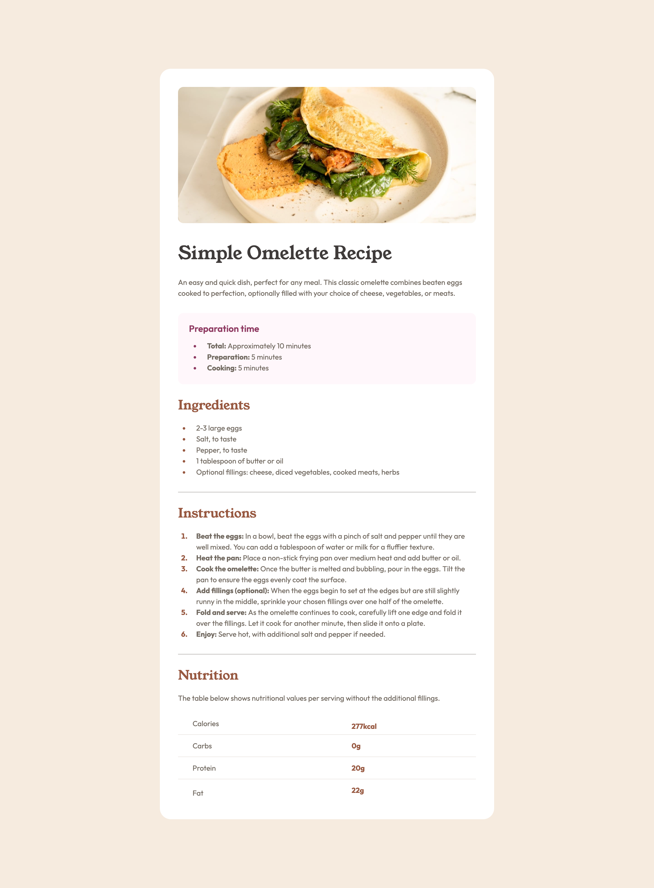

# Frontend Mentor - Recipe page solution

This is a solution to
the [Recipe page challenge on Frontend Mentor](https://www.frontendmentor.io/challenges/recipe-page-KiTsR8QQKm).
Frontend Mentor challenges help you improve your coding skills by building realistic projects.

## Table of contents

- [Overview](#overview)
    - [The challenge](#the-challenge)
    - [Screenshot](#screenshot)
    - [Links](#links)
- [My process](#my-process)
    - [Built with](#built-with)
    - [What I learned](#what-i-learned)
    - [Continued development](#continued-development)
    - [Useful resources](#useful-resources)
- [Author](#author)
- [Acknowledgments](#acknowledgments)

## Overview

### Screenshot



### Links

- Solution URL: [GitHub](https://github.com/super7ramp/frontend-mentor/4-recipe-page)
- Live Site
  URL: [GitHub Pages](https://super7ramp.github.io/frontend-mentor/4-recipe-page/recipe-page-main/)

## My process

### Built with

- Semantic HTML5 markup
- Flexbox

### What I learned

#### Styling tables

There might be a simpler way, but it works:

```css
article table {
    border-collapse: collapse;
}

article table tr th {
    padding: 0 0 0 32px;
}

article table tr td {
    padding: 0 0 0 16px;
}

article table tr:not(:first-child) th, article table tr:not(:first-child) td {
    border-style: solid;
    border-width: 1px 0 0 0;
    padding-top: 12px;

    border-color: var(--fg-color-muted);
}

article table tr:not(:last-child) th, article table tr:not(:first-child) td {
    padding-bottom: 12px;
}
```

### Continued development

Find a less awkward way to set the image width.

### Useful resources

- [MDN doc on `<table>`](https://developer.mozilla.org/fr/docs/Web/HTML/Reference/Elements/table)

## Author

- Website - [Antoine Belvire](https://belv.re)
- Frontend Mentor - [@super7ramp](https://www.frontendmentor.io/profile/super7ramp)

## Acknowledgments

All reviewers for their useful feedback.
