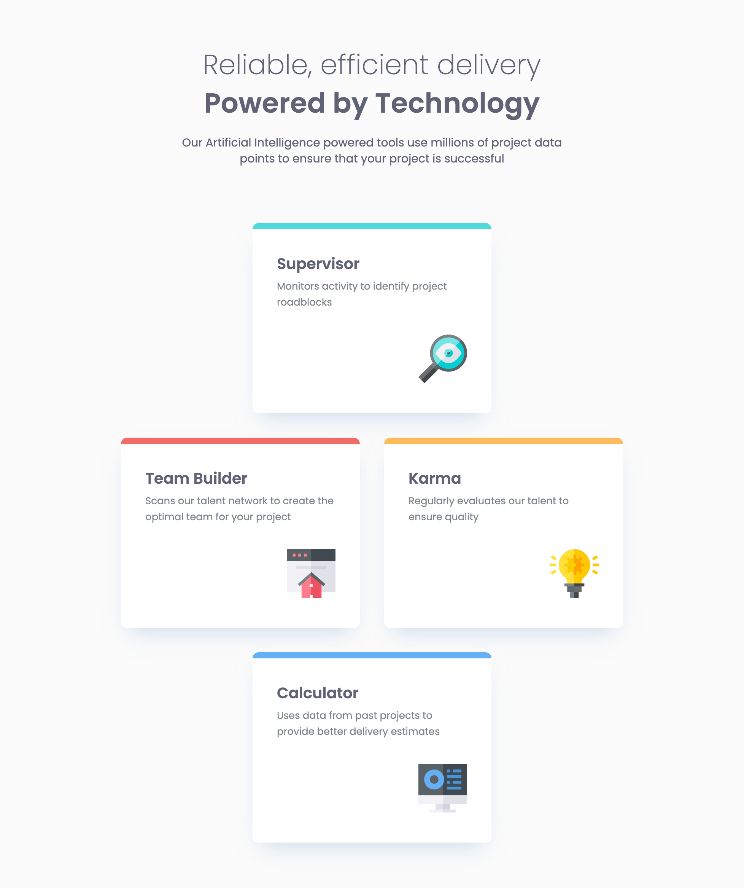
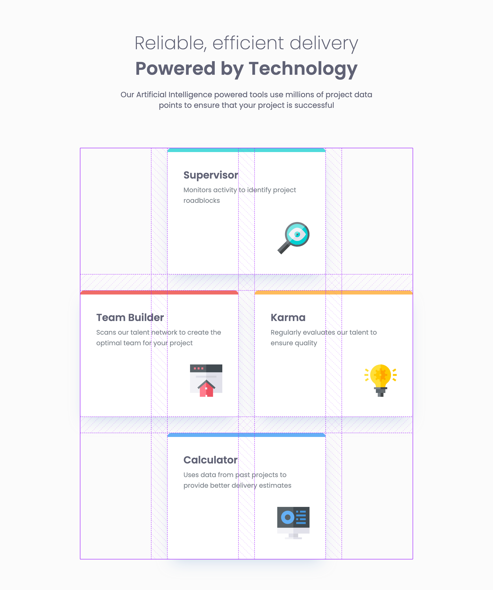

# Frontend Mentor - Four card feature section solution

This is a solution to
the [Four card feature section challenge on Frontend Mentor](https://www.frontendmentor.io/challenges/four-card-feature-section-weK1eFYK).
Frontend Mentor challenges help you improve your coding skills by building realistic projects.

## Table of contents

- [Overview](#overview)
    - [The challenge](#the-challenge)
    - [Screenshot](#screenshot)
    - [Links](#links)
- [My process](#my-process)
    - [Built with](#built-with)
    - [What I learned](#what-i-learned)
    - [Continued development](#continued-development)
    - [Useful resources](#useful-resources)
- [Author](#author)
- [Acknowledgments](#acknowledgments)

## Overview

### The challenge

Users should be able to:

- View the optimal layout for the site depending on their device's screen size

### Screenshot



Add a screenshot of your solution. The easiest way to do this is to use Firefox to view your project, right-click the
page and select "Take a Screenshot". You can choose either a full-height screenshot or a cropped one based on how long
the page is. If it's very long, it might be best to crop it.

Alternatively, you can use a tool like [FireShot](https://getfireshot.com/) to take the screenshot. FireShot has a free
option, so you don't need to purchase it.

Then crop/optimize/edit your image however you like, add it to your project, and update the file path in the image
above.

### Links

- Solution URL: [GitHub](https://github.com/super7ramp/frontend-mentor/6-four-card-feature-section)
- Live Site
  URL: [GitHub Pages](https://super7ramp.github.io/frontend-mentor/6-four-card-feature-section/four-card-feature-section-master/)

## My process

### Built with

- Semantic HTML5 markup
- CSS Flexbox
- CSS Grid
- Mobile-first workflow

### What I learned

#### "Merged cell" with CSS grid

The key is to have more columns (or rows) than needed and increase span of the cells to 2 or more columns (or rows).

E.g. for tablet:

```css
@media (700px <= width < 1150px) {
    .tools {
        grid-template-rows: repeat(3, 1fr);
        grid-template-columns: repeat(4, 1fr);
    }

    .tools section:first-child, .tools section:last-child {
        grid-column-start: 2;
        grid-column-end: 5;
    }

    .tools section:nth-child(2) {
        grid-column-start: 1;
        grid-column-end: 3;
    }

    .tools section:nth-child(3) {
        grid-column-start: 3;
        grid-column-end: 5;
    }
}
```

This gives this layout:



#### `box-shadow` on each feature card

```css
.tools section {
    /* color, x, y, blur, spread */
    box-shadow: var(--shadow-color) 0 15px 30px -11px;
}
```

### Continued development

None.

### Useful resources

- [This StackOverflow question](https://stackoverflow.com/questions/70397574/how-to-create-css-grid-system-with-merged-cells) -
  To merge cells with CSS grid.
- [MDN documentation on `box-shadow`](https://developer.mozilla.org/en-US/docs/Web/CSS/box-shadow) - To get the shadow
  on each tool card right.

## Author

- Website - [belv.re](https://belv.re)
- Frontend Mentor - [@super7ramp](https://www.frontendmentor.io/profile/super7ramp)

## Acknowledgments

All reviewers for their useful feedback ❤️

