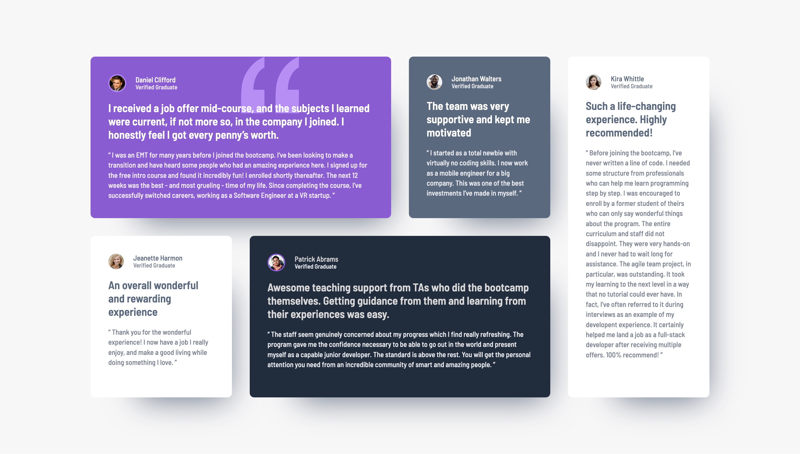

# Frontend Mentor - Testimonials grid section solution

This is a solution to
the [Testimonials grid section challenge on Frontend Mentor](https://www.frontendmentor.io/challenges/testimonials-grid-section-Nnw6J7Un7).
Frontend Mentor challenges help you improve your coding skills by building realistic projects.

## Table of contents

- [Overview](#overview)
    - [The challenge](#the-challenge)
    - [Screenshot](#screenshot)
    - [Links](#links)
- [My process](#my-process)
    - [Built with](#built-with)
    - [What I learned](#what-i-learned)
    - [Continued development](#continued-development)
    - [Useful resources](#useful-resources)
- [Author](#author)
- [Acknowledgments](#acknowledgments)

## Overview

### The challenge

Users should be able to:

- View the optimal layout for the site depending on their device's screen size

### Screenshot

### Links

- Solution URL: [GitHub](https://github.com/super7ramp/frontend-mentor/7-testimonials-grid-section)
- Live Site
  URL: [GitHub Pages](https://super7ramp.github.io/frontend-mentor/7-testimonials-grid-section/testimonials-grid-section-main/)

## My process

### Built with

- Semantic HTML5 markup
- CSS Flexbox
- CSS Grid
- Mobile-first workflow

### What I learned

Not much but gained experience 💪

### Continued development

Investigate whether preprocessor like SASS or SCSS could reduce boilerplate.

### Useful resources

- [MDN documentation on `blockquote`](https://www.example.com)
- [Google Fonts](https://fonts.google.com/) - To get the design fonts.

## Author

- Website - [Antoine Belvire](https://belv.re)
- Frontend Mentor - [@super7ramp](https://www.frontendmentor.io/profile/super7ramp)

## Acknowledgments

All reviewers for their useful feedback ❤️

