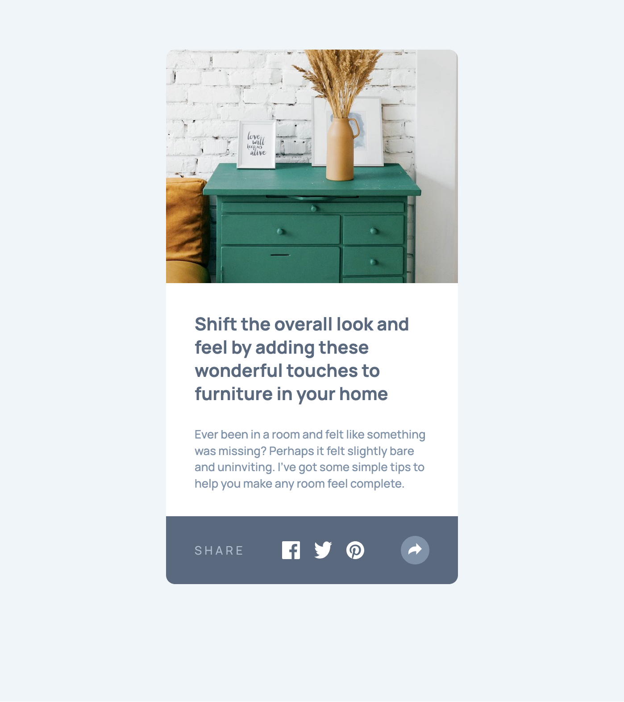

# Frontend Mentor - Article preview component solution

This is a solution to
the [Article preview component challenge on Frontend Mentor](https://www.frontendmentor.io/challenges/article-preview-component-dYBN_pYFT).
Frontend Mentor challenges help you improve your coding skills by building realistic projects.

## Table of contents

- [Overview](#overview)
    - [The challenge](#the-challenge)
    - [Screenshot](#screenshot)
    - [Links](#links)
- [My process](#my-process)
    - [Built with](#built-with)
    - [What I learned](#what-i-learned)
    - [Continued development](#continued-development)
    - [Useful resources](#useful-resources)
- [Author](#author)
- [Acknowledgments](#acknowledgments)

## Overview

### The challenge

Users should be able to:

- View the optimal layout for the component depending on their device's screen size
- See the social media share links when they click the share icon

### Screenshot



### Links

- Solution URL: [GitHub](https://github.com/super7ramp/frontend-mentor/9-article-preview-component)
- Live Site
  URL: [GitHub Pages](https://super7ramp.github.io/frontend-mentor/9-article-preview-component/article-preview-component-master)

## My process

### Built with

- Semantic HTML5 markup
- CSS custom properties
- Flexbox
- CSS Grid
- Mobile-first workflow
- Vanilla JavaScript

### What I learned

#### Using `rem` units

Following advice received on a previous challenge, used `rem` units for font sizes to ensure that text scales
properly with user preferences. Used variables in "pixels" for easier reading and reference to the design.

```css
:root {
    --13px: 0.8125rem;
    --20px: 1.25rem;
}

.text-preset-1 {
    font-size: var(--20px);
}

.text-preset-2 {
    font-size: var(--13px);
}
```

#### Using BEM naming convention

Tried to follow the [BEM (Block Element Modifier)](https://getbem.com/introduction/) methodology for CSS class naming.

It looks like it does ease reading the CSS by flattening classes and avoiding inheritance:

```css
.share-button {
    background-color: var(--gray-200);
    border-radius: 50%;
    border-width: 0;
    margin: 0;
    padding: 0;
    width: var(--share-button-size);
    height: var(--share-button-size);
}

.share-button--toggled {
    background-color: var(--gray-500);
}

.share-button__icon--toggled {
    content: url("./images/icon-share-dark.svg");
}
```

But it also adds many classes to the HTML.

[`@scope`](https://blog.logrocket.com/css-scope-replace-bem/) might be a better solution in the future, but it looks
like it is not fully supported by browsers yet.

#### Adding event listener to show the modal

Could probably be simplified:

```js
const shareButtons = document.querySelectorAll('.share-button');
const shareButtonIcons = document.querySelectorAll('.share-button__icon');
const shareModal = document.querySelector('.share-modal');

shareButtons.forEach(button => {
    button.addEventListener('click', () => {
            shareModal.classList.toggle('share-modal--hidden')
            shareButtons.forEach(btn => btn.classList.toggle('share-button--toggled'))
            shareButtonIcons.forEach(icon => icon.classList.toggle('share-button__icon--toggled'))
        }
    )
})
```

#### Making the arrow of the share modal

I mean the small triangle on the bottom of the modal, for mobile and desktop views:


Used an `::after` pseudo-element to create the arrow:

```css
:root {
    --modal-width: var(--248px);
}

.share-modal::after {
    --arrow-height: var(--12px);

    /* The arrow is positioned at the bottom of the modal, in the middle */
    content: "";
    position: absolute;
    width: calc(2 * var(--arrow-height));
    height: var(--arrow-height);
    left: calc(var(--modal-width) / 2 - var(--arrow-height));
    top: var(--modal-height);

    /* This is here the magic happens: Top border gets "merged" with left and right transparent borders, creating
     * the triangle. */
    border-top: var(--arrow-height) solid var(--gray-900);
    border-left: var(--arrow-height) solid transparent;
    border-right: var(--arrow-height) solid transparent;
}
```

### Continued development

- CSS relative and absolute positioning.
- BEM naming.

### Useful resources

- [BEM 101](https://css-tricks.com/bem-101/) - An introduction to BEM methodology.
- [This StackOverflow answer to the popover arrow problem](https://stackoverflow.com/a/32386763) - Not the accepted
  answer, but the one I could understand.

## Author

- Website - [Antoine Belvire](https://belv.re)
- Frontend Mentor - [@super7ramp](https://www.frontendmentor.io/profile/super7ramp)

## Acknowledgments

All reviewers for their feedback ❤️
